# User documentation

Welcome to the user documentation! If you haven't yet, please, install the application,
as instructed in the [root readme](../../README.md).

## First run

This is what you will se first after you run it (as specified in [root readme](../../README.md)):

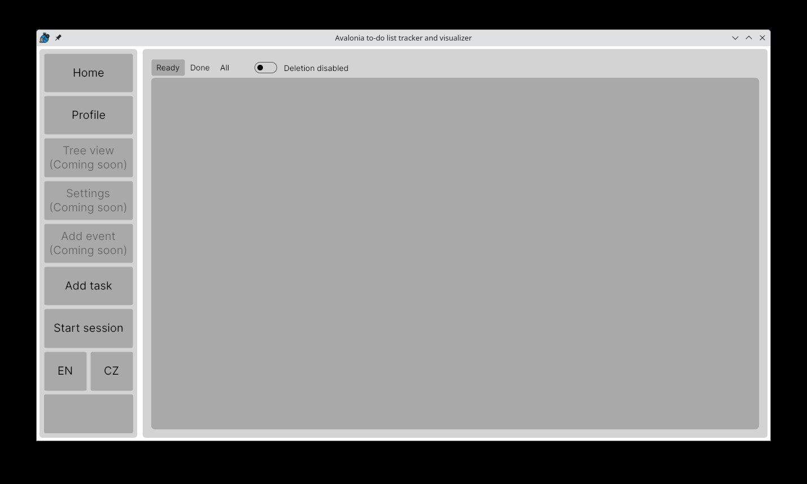

First, I will walk you through all the buttons:

 - home - this is where you are now
 - profile - statistics and goal setting
 - Add task - adds new task (we will explore this later)
 - Start session - starts session (we will also explore this later)
 - EN/CZ - you can switch between Czech and English any time, no need to restart the application!
 - Ready/Done/All - whether you want to se ready, completed or all tasks.
 - Deletion disabled/enabled - this turns the "Details" button into "Delete" button. Be careful, there are no more safeguards!

Bear in mind that "Ready" task means, that it is after (or on) its begin date and all prerequisites are completed.
Done is simply tasks marked done. You cannot mark done tasks, that are not ready.

## Adding tasks

By clicking on the Add task button, you can add tasks:

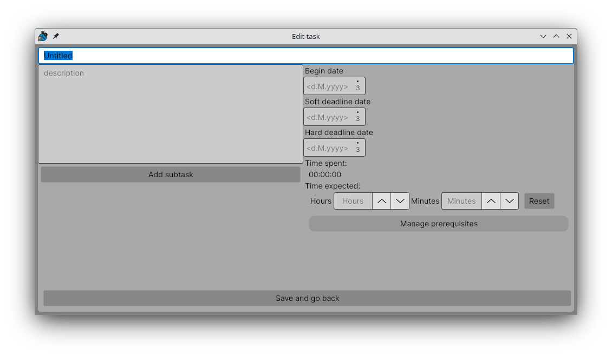

Here you can input name and description, add, remove, reorder and edit subtasks, setup begin times and deadlines and manage
prerequisites. You can also set expected time that task will take to finish. 

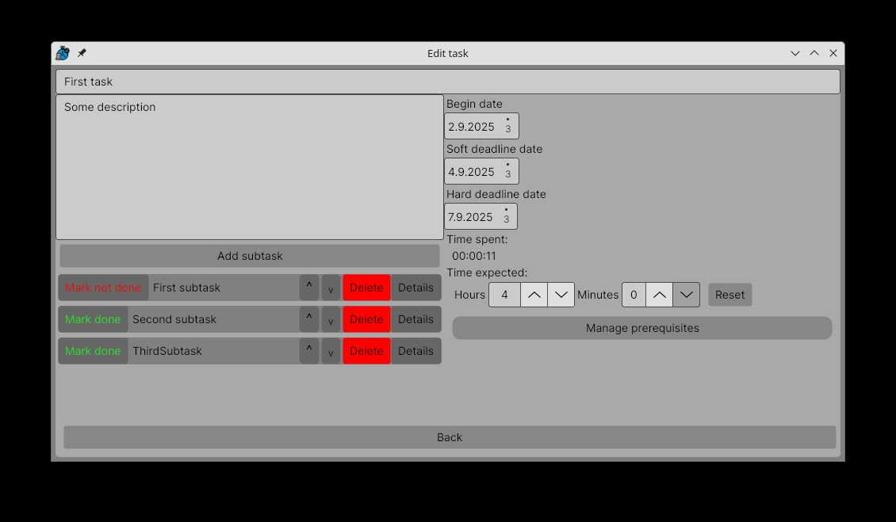

Subtasks don't have any specific behavior. Name field must not be empty - it will either stop you from
saving the new task, or closing the window of edited task.

After adding enough tasks, you can manage the prerequisites by clicking corresponding button and opening this dialog:

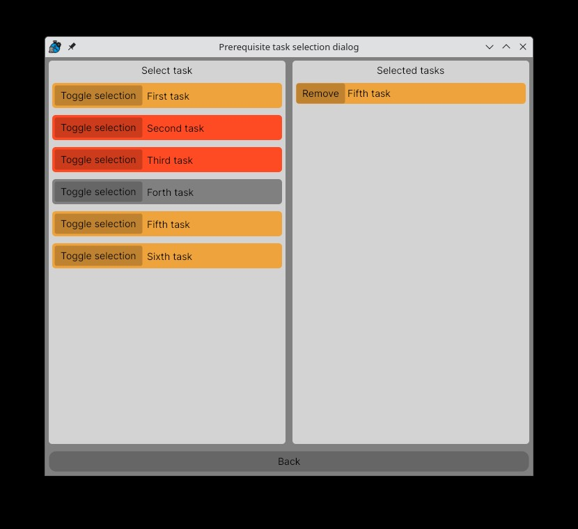

Tasks also have "select group" button on the right. By clicking that, you can assign colored groups to your tasks:

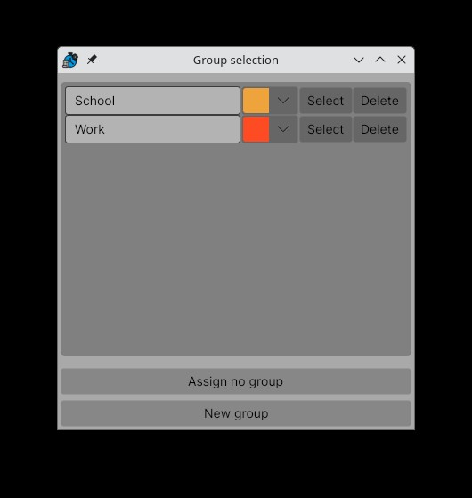

There is no limit on how many groups you have or how many tasks are assigned to one group. By closing the window
or hitting the `Assign no group button`, you deselect group from the task.

After creating some tasks, this is how your ready tab could look:

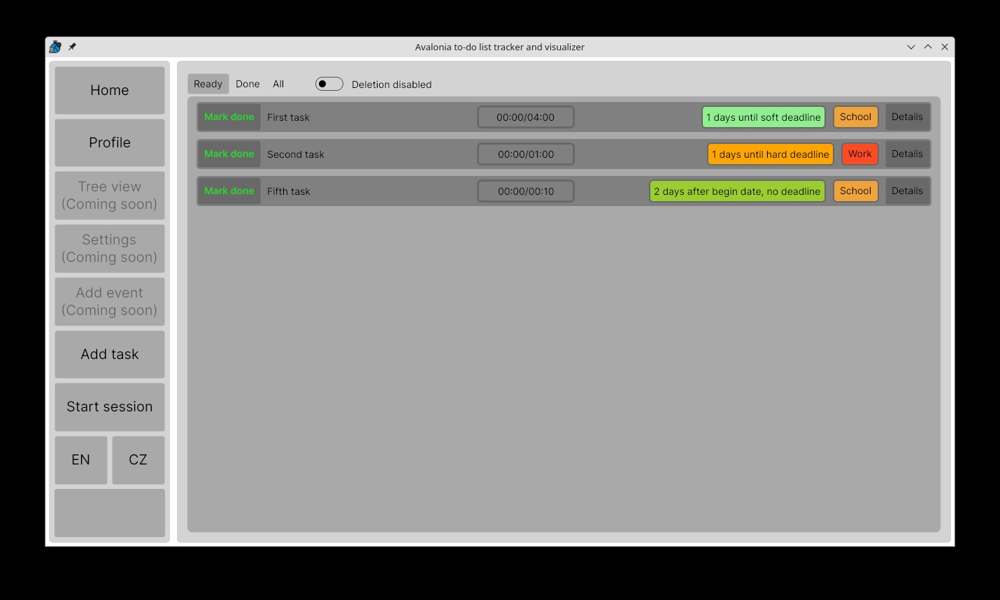

done tab:

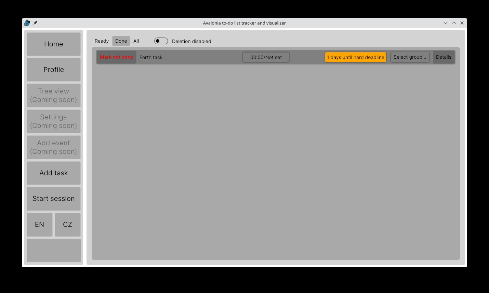

and all tab:

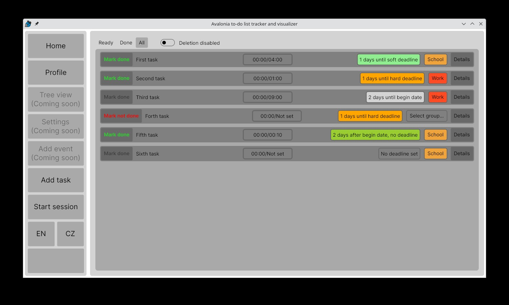

## Profile (statistics)

You can also view your statistics in the profile section (click on the `Profile` button on the left):

It is empty now, but you can set your daily goal here. It is saved, alongside tasks, groups and sessions, even though you
close the application!

## Sessions

In order to see some statistics and have some time on tasks, you need to start a session (and working). By clicking
on the `start session` button on the left, the session window shows up:

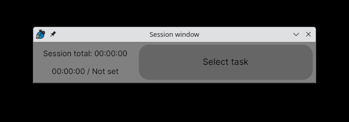

After clicking on `select task`:

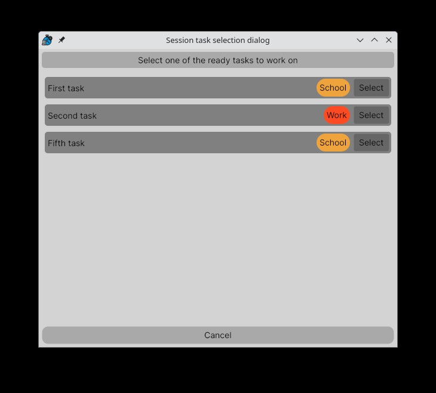

you can select your task. Please, bear in mind, only ready tasks are shown here, as only on those you can work.
After selecting one you like, you can start working:

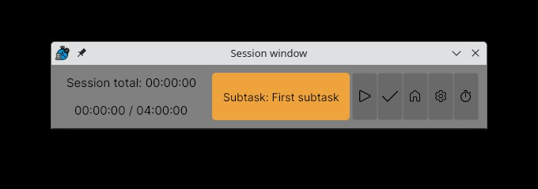

After clicking the play button, time will count towards that task. You will either see the next unfinished subtask
in order, or the task, if all subtask are already completed. You can click the (now pause) play button again,
to stop the timer. You can start and stop as many times as you want, the timer will continue where it left off.

To complete the current subtask/task, click the `done` button. By completing a task, timer will stop, and you will
have to select new one. You can also return back to selection by clicking the `home` button, or configure the
current selected task by clicking `settings` button. Beware, if you accidentally set the task up so it's not ready
anymore, you will be thrown back to task selection, and it will be unavailable from the sessions window!

if you like pomodoro technique, where you split work into shorter interval with managed pauses, you can try the pomodoro
timer by clicking the timer button:

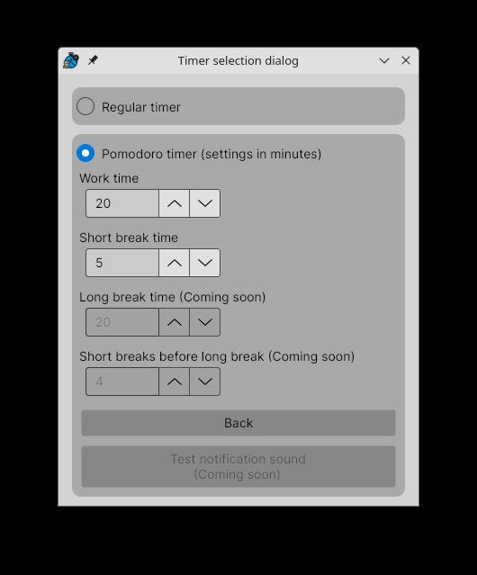

You can set only work time/short pause time, but in the future, more will come. There is also no sound
for now so you need to pay attention, whether your work time/break time is over:

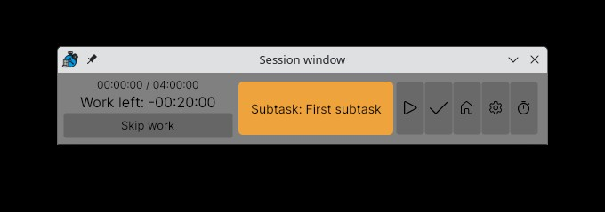

but don't worry, your work is counted even after running out of time - it's just overtime.
The work/breaks continue, until you click the `end` button you will see once the timer runs out.

Breaks are not counted towards tasks nor statistics. Only work time.

After some sessions, you will see some statistics if you close the session window and navigate to `Profile`.
This is an example after my short session (after I clicked `refresh` button):

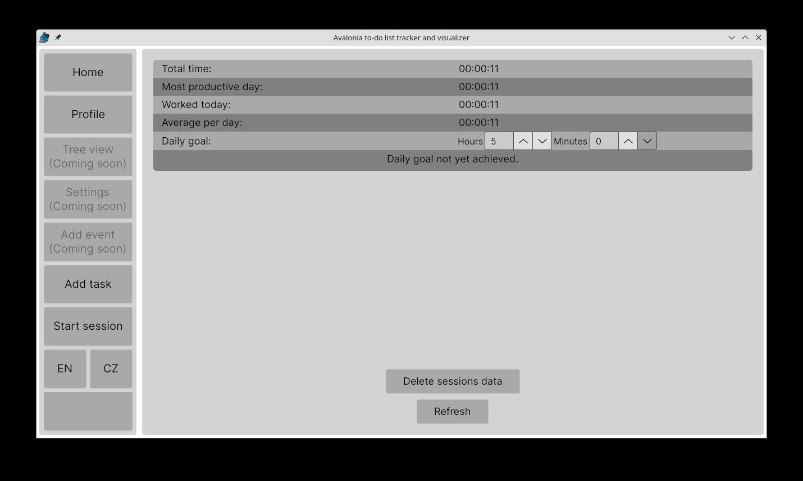

Beware of the `Delete sessions data`. This will delete data that go into statistics (not your tasks nor groups).
A dialog opens up to warn you so you can change your mind.

## Conclusion

And that is all! I hope you enjoy my application and help you be more productive. There is more coming in the
future, so, stay tuned and wait for upgrade instructions!
